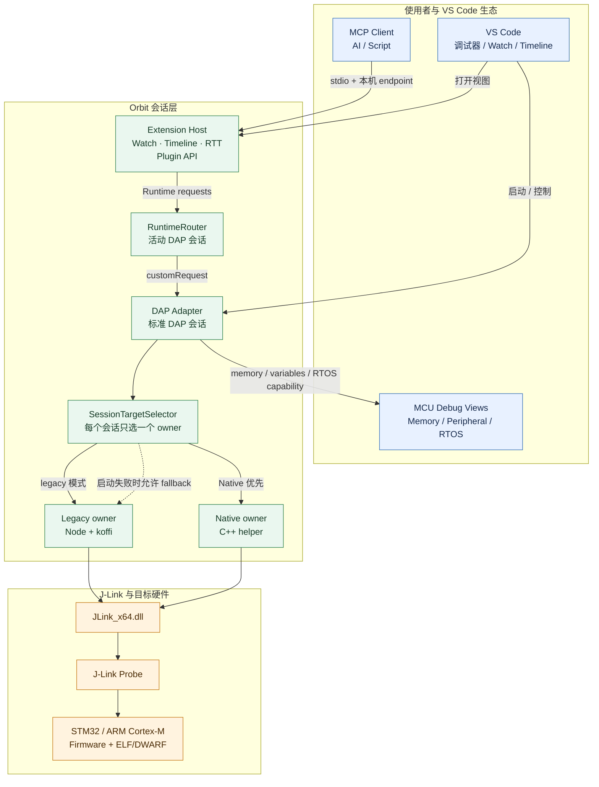

  

<h1 align="center">Orbit — The Debugger for What’s Next</h1>

  面向 STM32 / ARM Cortex-M 的 VS Code 调试前端：直接连接 J-Link， 
  把源码调试、运行时变量、波形、RTT 日志和自动化实验放在同一条目标访问链路上。

  <a href="Releases/docs/全套工具链教程.md">全套工具链教程</a> ·
  <a href="Releases/docs/user-guide.md">用户文档</a> ·
  <a href="https://github.com/zhuangyan114/Orbit/releases">Orbit Releases</a>

> 本 README 是 Orbit 正式版 1.0.0 的产品介绍与架构说明。首次使用请先阅读[全套工具链教程](Releases/docs/全套工具链教程.md)；需要查询 Orbit 的完整配置、功能细节和已知限制时，请阅读[用户文档](Releases/docs/user-guide.md)。

## Orbit 是什么

Orbit 是一个运行在 VS Code 中的嵌入式调试前端。它以 Debug Adapter Protocol（DAP）承接 VS Code 的调试请求，通过 J-Link DLL 访问 STM32 / ARM Cortex-M 目标，并在同一目标所有权模型下提供：

- 源码级启动、暂停、继续、单步、复位和断点；
- 可展开的 Watch 表达式、运行时数值写入和变化高亮；
- Timeline 实时采样、缩放、悬停读数和短期历史保留；
- SEGGER RTT 输出、ANSI 处理和 P-RTLog tokenized 帧解码；
- 通过标准 DAP memory / variables 能力接入外部 Memory View、Peripheral Viewer 和 RTOS Views；
- 面向脚本和 AI 工具的本机 Plugin API 与 MCP 适配器。

Orbit 的目标不是复制一个完整 IDE，而是把“程序停在哪里、变量现在是多少、波形怎样变化、日志从哪里来、实验是否可重复”连接到同一套调试会话中。

## 能力地图

### 源码调试

Orbit 暴露 `ozone` DAP 调试器类型，使用 ELF/AXF 载入符号、行号和 DWARF 类型信息。标准 DAP 的 `evaluate`、可展开 `variablesReference`、结构体/数组/指针子节点、`memoryReference`、读写内存和 RTOS capability 会保留给 VS Code 及外部视图使用。

### 运行时观察

WATCH 和 TIMELINE 是两个 VS Code Webview 视图。Watch 负责表达式列表、子节点展开、数值编辑和发送到 Timeline；Timeline 负责采样通道、曲线、时间窗口、自动跟随、手动缩放及悬停读数。两者的表达式与视图状态保存在 VS Code workspace state 中。

### 日志与实时数据

  RTT 由选定的目标 owner 读取，既可以显示在 `Orbit RTT Log` 终端，也可以显示在 Debug Console。启用 P-RTLog 后，Orbit 从 ELF 的 `.pw_tokenizer.entries` 节加载 token 数据，再把 RTT 二进制帧转换为带级别、模块和位置的文本。

### 外部调试视图

Memory View、Peripheral Viewer、RTOS Views 和 debug tracker 不是 Orbit 内置的独立实现。Orbit 通过 DAP memory / variables、`deviceName`、`svdFile` / `svdPath` 以及 `trackDebuggers` 设置为这些外部扩展提供连接面；它们的版本、寄存器树和 RTOS 解析能力由外部扩展决定。

### 自动化与 AI 接入

Extension Host 激活时启动仅监听 `127.0.0.1` 的 Plugin API，并写出带随机 Bearer Token 的 endpoint 文件。独立的 MCP server 通过 stdio 暴露状态、批量读写、录波和通用实验工具；目标访问仍由 Orbit 的活动调试会话负责。

## 系统架构

Orbit 的访问链路可以概括为：

**VS Code / MCP → Orbit 会话层 → 一个 J-Link owner → J-Link DLL → 目标 MCU**

数据流和所有权关系：

- VS Code 的调试请求进入 DAP Adapter；Watch、Timeline、RTT 和 MCP 的运行时请求最终复用活动的 DAP 会话。
- `SessionTargetSelector` 在每个会话中只建立一个物理 target owner：Native helper 或 Legacy `koffi` channel。
- Native helper 与 Legacy channel 都通过 `JLink_x64.dll` 访问 J-Link；DLL 之后才是探针和目标 MCU。
- Memory View、Peripheral Viewer、RTOS Views 位于 DAP 会话外侧，通过标准 DAP 数据和 launch metadata 接入，不是 Orbit 内置的第二套调试后端。

关键架构约束：

- 一个 `ozone` DAP session 只有一个物理 J-Link owner：Native helper 或 Legacy koffi；不会在同一会话中并行持有两个 owner。
- NativeScheduler 将控制操作置于 Watch、Timeline 读取之前；控制操作完成后再恢复采样。
- 活动 DAP session 存在时，Watch、Timeline、evaluate、变量写入、Memory View、RTOS/Peripheral Viewer 和 RTT 都沿活动 owner 路由。
- Native owner 的失败回退只发生在启动阶段；已连接的 Native owner 丢失后会结束当前会话，要求重新启动，不会热切换到第二个 DLL owner。

## 产品边界

Orbit 的正式能力边界由当前源码和依赖共同决定：

| 范围 | Orbit 负责 | 仍由外部环境负责 |
| --- | --- | --- |
| 调试访问 | DAP、目标 owner、J-Link DLL 调用、符号/DWARF 解析 | J-Link probe、目标供电、目标设备和固件 |
| 烧录 | 可选地调用 JLink.exe 的 CommanderScript 烧录流程 | J-Link 软件包和 `JLink.exe` 安装 |
| RTOS / 外设 | 提供 DAP 数据、RTOS capability、SVD launch metadata 及 debugger tracking 接口 | RTOS Views、debug tracker、Peripheral Viewer、SVD 内容 |
| MCP | 本机 Plugin API 和 MCP server 适配器 | MCP 宿主、AI 客户端、用户对目标写入的授权 |
| 发布物 | VSIX 中的扩展构建产物及 Native helper | Releases 页面中的 VSIX、MCP 和 SKILL 资产命名与发布流程 |

## 文档与发布

- [全套工具链教程](Releases/docs/全套工具链教程.md)：面向第一次从 Keil5 等集成 IDE 转到 VS Code 的用户，从零安装和配置 ARM GCC、CMake、CMake Tools、J-Link 与 Orbit，并完成第一次编译和调试。
- [用户文档](Releases/docs/user-guide.md)：面向已经具备基本 VS Code/嵌入式开发环境的用户，作为 Orbit 的正式参考手册，覆盖安装要求、`launch.json`、Watch、Timeline、RTT、P-RTLog、RTOS Views、Memory View、Peripheral Viewer、Native/Legacy、MCP、FAQ 和已知限制。

两份教程互相补充，并不是重复内容：

| 文档 | 适用对象 | 主要内容 |
| --- | --- | --- |
| [全套工具链教程](Releases/docs/全套工具链教程.md) | 没有完整 VS Code + ARM GCC + CMake 环境，或第一次使用 Orbit 的用户 | 按步骤搭建开发环境，完成工具安装、CMake 配置、编译、J-Link 安装和首次调试 |
| [用户文档](Releases/docs/user-guide.md) | 已能编译工程，需要深入使用 Orbit 的用户 | 查阅 Orbit 的配置项、调试视图、实时数据、日志、MCP、调试通道、常见问题和能力边界 |

推荐阅读顺序：第一次使用 Orbit 时先看[全套工具链教程](Releases/docs/全套工具链教程.md)，完成环境搭建后再把[用户文档](Releases/docs/user-guide.md)作为功能参考手册。

- [Orbit Releases](https://github.com/zhuangyan114/Orbit/releases)：正式版 VSIX 及后续发布资产。

## 1.0.0 更新日志

- 以 Orbit 品牌整理正式版产品介绍和系统架构说明。
- 将完整使用方法从 README 拆分到独立用户文档。
- 明确 Native / Legacy 单 owner 调试通道、DAP 路由、外部视图边界和 MCP 本机安全边界。

## 许可证

MIT
