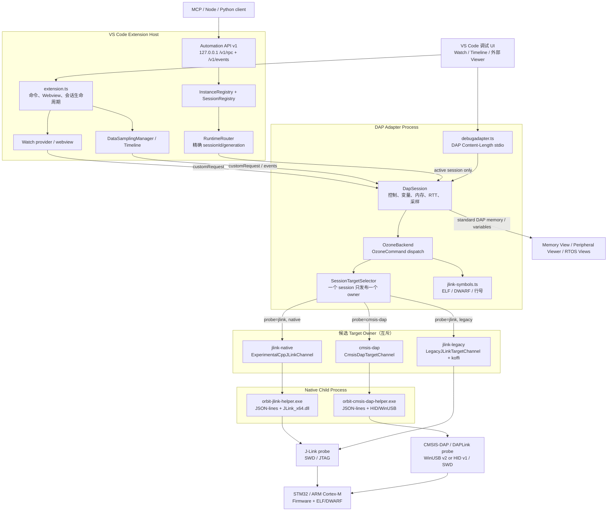

# Orbit for VS Code - 项目架构图

> 本图描述当前 `orbit` DAP 调试路径；`ozone` 仅作为旧配置兼容别名。维护时应与 `AGENTS.md` 的单 owner、调度优先级和活动会话路由约束保持一致。



## 进程与职责

| 边界 | 入口 | 职责 |
|---|---|---|
| Extension Host | `src/extension.ts` | Watch/Timeline UI、Automation API v1（默认关闭）、活动 session identity/generation、DAP custom request 路由 |
| DAP Adapter | `src/debugadapter.ts`、`src/debug/dap-session.ts` | DAP 协议、目标控制、变量/内存、RTT、采样、停止/终止事件；不导入 `vscode` |
| J-Link helper | `native/jlink-helper/src/main.cpp` | 在独立进程加载 `JLink_x64.dll`，提供 J-Link 控制、内存、断点、源码步进和 RTT |
| CMSIS-DAP helper | `native/cmsis-dap-helper/src/main.cpp` | 枚举 HID/WinUSB、CMSIS-DAP framing、SWD/DP/AP、Cortex-M 控制、内存、FPB、Flash Algorithm 和内存型 RTT |

一次调试会话实际只启动所选 owner 所需的 helper。J-Link Legacy 是例外：它在 DAP Adapter 进程内由 `koffi` 加载 DLL。

## Owner 选择

- `probe: "jlink"` 使用 `jlink-native` 或 `jlink-legacy`。`auto` 只允许在 native 启动/初始化失败且进程完全退出后创建 legacy；已连接 owner 丢失时不热切换。
- `probe: "cmsis-dap"` 只创建 `cmsis-dap` owner。`cmsisDapTransport: "auto"` 优先 WinUSB v2，再选择兼容的 HID v1；不会回退到 J-Link、Legacy 或第二个 helper。
- Flash、DAP、Watch、Timeline、RTT、RTOS View、Memory View 和 Peripheral Viewer 都复用当前 owner。
- owner loss、session termination 或 replacement 会取消排队工作、阻止旧 generation 发布，并在退出前释放 helper。

## 访问调度

Native owner 访问按以下优先级串行化：

```text
control > watch > timeline > background
```

- `control`: run、halt、reset、step、断点、变量/内存/外设写入和 Flash；
- `watch`: Watch、evaluate、变量树及必要的高优先级读取；
- `timeline`: 可取消的数据采样；
- `background`: RTT、RTOS refresh 和诊断性读取。

控制请求的完整临界区暂停低优先级读取；Watch 在小分片之间释放 target-read gate。任何优化都不能通过禁用 Watch/Timeline/Viewer 或建立第二条目标连接实现。

## 四条主要数据流

1. **Watch / evaluate**: Webview 或 VS Code DAP request -> `DapSession` -> `OzoneBackend` -> 当前 owner。运行态 realtime path 不额外查询 target state。
2. **Timeline**: `DataSamplingManager` -> 活动 session `dataSample` -> scheduler timeline work -> `ozoneDataSamples`；结果发布前检查 session identity 和 generation。
3. **RTT**: J-Link owner 使用 DLL RTT API；CMSIS-DAP owner通过目标内存读取 SEGGER RTT control block 和 ring buffer。两者都属于当前 owner，轮询为 background work。
4. **Viewer / Automation API / MCP**: Viewer 使用标准 DAP `variables`、`memoryReference`、`readMemory`、`writeMemory` 和 SVD metadata。Automation API v1 只监听 `127.0.0.1`，按 `instanceId`/`projectId`/`sessionId`/`sessionGeneration` 绑定可见 Orbit session；MCP、Node CLI 和 Python 客户端都走同一 `/v1/rpc` 与 `/v1/events`。活动 DAP session 存在时不得回退 Extension Host backend，也不得创建第二个 target owner。

## Automation API v1

- 开关：`orbit.automation.enabled`（默认 `false`）。关闭后不启动 endpoint，不影响标准调试。
- 权限：`orbit.automation.allowedScopes` 默认仅 `read`；mutation scope 需工作区确认。
- 发现：用户范围 registry pointer + 每窗口 endpoint 文件；相同 `projectId` 的多窗口必须显式 `instanceId`。
- 兼容：一个发布周期保留旧 `POST /rpc`（`ozone.*`）映射到新 service，并带 deprecation；不得跳过 handshake/generation。
- 验收分层：自动化 / Mock / 真实硬件分开报告。1.1.0 已通过 J-Link native 与 CMSIS-DAP HID v1（无 flash）；未授权的 J-Link legacy 与显式 Flash 标为 `out-of-scope`，不得写成通过。见 [硬件验收](api/orbit-automation-hardware-acceptance.md)。

## 相关文档

- [Automation API v1](api/orbit-automation-api.md)
- [验收矩阵](api/orbit-automation-acceptance-matrix.md)
- [硬件验收](api/orbit-automation-hardware-acceptance.md)
- [DAP/owner 验证矩阵](debug-engine-refactor/validation-matrix.md)
- [Native scheduler 设计](debug-engine-refactor/native-scheduler-design.md)
- [实时变量保护](debug-engine-refactor/realtime-variable-protection.md)
- [`AGENTS.md`](../AGENTS.md)
