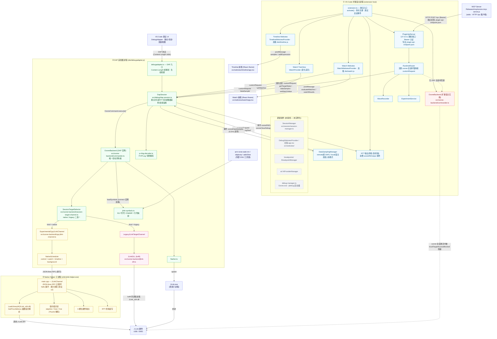

# Orbit for VS Code — 项目架构图

> 本图描述 Orbit(ozone 调试类型)扩展的完整架构,包括 3 个进程边界、目标访问双通道、Webview、插件 API 与 MCP。
> 图中灰色虚线节点为**未接线(遗留/未被 `extension.ts` 实例化)**组件。
> 维护时应与 `AGENTS.md` 中的架构约束(单目标拥有者、调度优先级、DAP 路由契约)保持一致。

## 分层说明

### 进程模型(3 个进程)

| 进程 | 入口 | 职责 |
|---|---|---|
| 扩展宿主 | `src/extension.ts` → `dist/extension.js` | UI(Watch/Timeline webview)、插件 API HTTP 服务器、宿主侧 `OzoneBackend` |
| DAP 适配器 | `src/debugadapter.ts` → `dist/debugadapter.js` | 通过 stdio `Content-Length` 帧与 VS Code 通信;持有**唯一目标所有者** |
| Native Helper | `native/jlink-helper/src/main.cpp` → `orbit-jlink-helper.exe` | 独立子进程,内部加载 `JLink_x64.dll`(DLL 不进入 Node 进程) |

- `OzoneBackend` 在扩展宿主与 DAP 中各实例化一份,行为差异由构造参数决定(`sessionTarget` / `localTargetAccessBlocked`)。
- **DAP 会话激活期间 DAP 拥有目标访问权**:扩展宿主后端被 `localTargetAccessBlocked` 回调拒绝;`SessionManager` 在会话激活时不得连接宿主后端。`ozone.debug` 命令先 `disconnect` 释放宿主连接,再启动 DAP。

### 目标通道双模式(每会话单一物理 J-Link 拥有者)

- **native**(默认优先):`ExperimentalCppJLinkChannel` 派生 helper 子进程,JSON-lines RPC(`hello` 握手 + 能力协商,协议 v2),所有调用经 `NativeScheduler` 按 `control > watch > timeline > background` 严格串行化;control 请求暂停 timeline/background。
- **legacy**:`LegacyJLinkTargetChannel` 通过 koffi 将 `JLink_x64.dll` 加载进适配器进程。仅在 native 启动失败时(或 `auto` 模式)回退;**已连接的 native owner 永不热切换**;`NativeOwnerLost` 时清空 owner 并要求重启会话,失败回退不留任何 owner。
- 安全规则:6 槽位索引硬件断点、无 `ExecCommand("SetBP ...")`、`disconnect` 不得以 close/open 做 owner 切换。

### 四条主要数据流

1. **Watch 求值/轮询**:Webview → `WatchWebviewProvider` → `session.customRequest('dataSample')` → `DapSession.handleDataSample` → `OzoneBackend.execute(evaluateExpression)` → 目标通道;宿主 `startWatchPolling` 按 `orbit.watchPollIntervalMs` 定时走同一路径并同步推给 TreeView 与 Webview。
2. **Timeline 采样**:`DataSamplingManager` 双模式 —— remote(DAP 侧 0.2ms 高频采样,16ms 经 `ozoneDataSamples` 事件推送,采样期间暂停 RTT 轮询)/ local(无 DAP 会话时宿主 `setTimeout` 循环 `evaluateExpression`)。
3. **RTT Log**:`DapSession.startRttLogPolling`(`rttPollIntervalMs`)→ `readRtt` → 经 `ozoneRttOutput` / `ozoneClearDebugConsole` 事件写入 RTT 伪终端;支持 p-RTLog 令牌解码与 ANSI 剥离。
4. **插件 API**:MCP(stdio)→ `POST /rpc`(Bearer)→ `PluginApiServer.dispatch` → `RuntimeRouter` → 活跃会话存在时一律 `session.customRequest`(跨进程),否则回退宿主后端。`WaveRecorder` 按 interval 采帧,`ExperimentService` 编排 read/write/wait/record。

### 遗留(未接线)组件

`SessionManager`、`DebugWebviewProvider` / 旧版 `src/webview/app.tsx`、`breakpoints/`、`ai/`、`debug-manager.ts`(Ozone.exe 启动器)未被 `extension.ts` 实例化,图中以灰色虚线标出,当前激活路径为:宿主后端 + Watch/Timeline webview + PluginApiServer + DAP 进程。

### 相关文档

- `docs/plugin-api-plan-zh.md` — 插件 API 设计
- `docs/debug-engine-refactor/` — 调试引擎重构说明
- `AGENTS.md` — 架构约束与开发流程(本图应与其保持同步)
